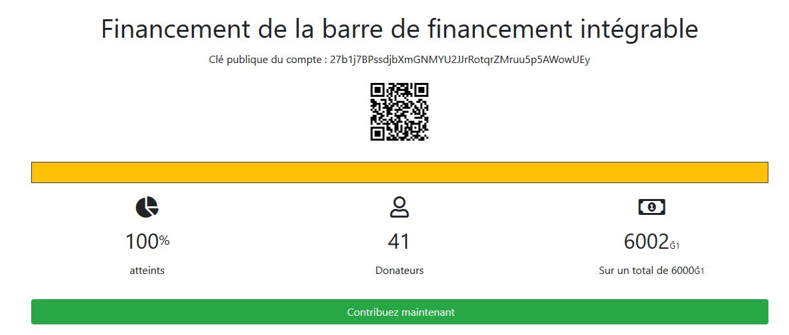

# Barre de financement intégrable

Barre de financement intégrable dans une page web pour suivre l'évolution d'un financement participatif.

## Installation

* Déposez l'ensemble des fichiers dans un dossier sur votre serveur
* Paramétrez votre serveur web (Apache ou Nginx) pour rendre le dossier accessible depuis le web
* Le dossier qrcodes doit être accessible en écriture pour le compte utilisé par votre serveur web (en général www-data)
* L'iframe sera alors accessible via http(s)://votredomaine.com/votre_chemin/iframe.php
* Pensez à passer les paramètres nécessaires :

Par exemple : http(s)://votredomaine.com/votre_chemin/iframe.php?pubkey=78ZwwgpgdH5uLZLbThUQH7LKwPgjMunYfLiCfUCySkM8&target=10000&start_date=01/09/2019

## Liste des paramètres obligatoires

* **start_date** (date de début du financement participatif)
* **pubkey** (pubkey concernant le financement participatif)
* **target** (montant à atteindre pour le financement participatif)

## Liste des paramètres facultatifs

* **title** (intitulé du financement)
* **end_date** (date de fin du financement participatif)
* **unit** (valeurs possibles : *relative* | *quantitative* (valeur par défaut))
* **node** (nœud duniter à interroger. Par exemple : *g1.duniter.org* qui est la valeur par défaut)
* **display_pubkey** (Affiche la pubkey. Valeur par défaut : *false*)
* **display_qrcode** (Affiche le qrcode pour la pubkey. Valeur par défaut : *false*)
* **display_button** (Affiche le bouton pour faire un don via l'API Cesium. Valeur par défaut : *false*)
* **display_graph** (Affiche l'évolution du financement. Valeur par défaut : *false*)
* **background_color** (Couleur de fond, en hexadecimal. Valeur par défaut : *ffffff*)
* **font_color** (Couleur de la police, en hexadecimal. Valeur par défaut : *212529*)
* **progress_color** (Couleur de la barre de progression, en hexadecimal. Valeur par défaut : *ffc107*)
* **border_color** (Couleur de bordure de la barre de progression, en hexadecimal. Valeur par défaut : *343a40*)